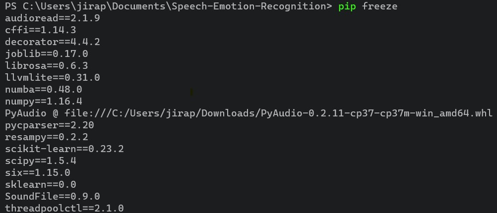

# For Windows Error

## for [pyAudio](https://www.lfd.uci.edu/~gohlke/pythonlibs/#pyaudio)
## for No module named 'numba.decorators'
use pip install numba==0.48

 

# Reference
[How to Make a Speech Emotion Recognizer Using Python And Scikit-learn](https://www.thepythoncode.com/article/building-a-speech-emotion-recognizer-using-sklearn)
